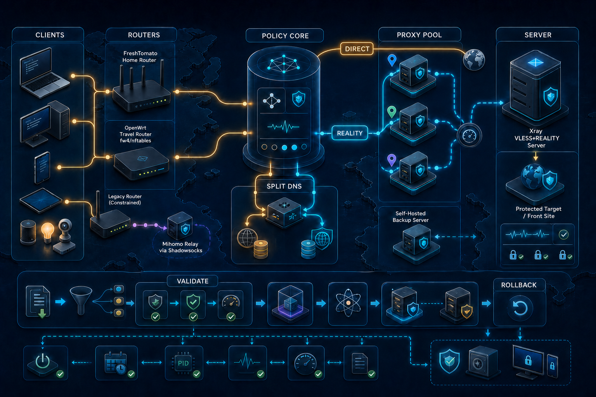
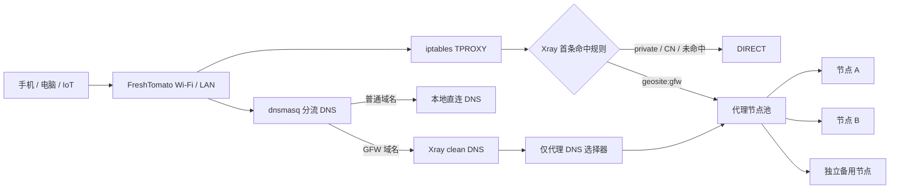
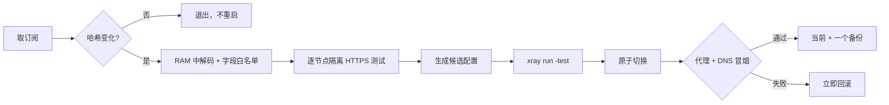

# reality-handshake

一套给 Agent 和人共同使用的 Xray / VLESS+REALITY 运维知识与安全工作流。它不仅诊断握手失败，也覆盖 macOS/Linux 客户端接入、家用/旅行路由器透明代理、低端 OpenWrt Shadowsocks 桥接、GFW List 分流 DNS、多节点容灾、订阅刷新、开机恢复和失败回滚。

> 目标不是“一键套配置”，而是让每一次变更都能验证、回滚，不把订阅和节点秘密写进日志或 Git。

[](./LICENSE)
[](https://github.com/toolazytoname/reality-handshake/actions/workflows/validate.yml)
[](https://xtls.github.io/en/config/)



这张总览图从左到右覆盖客户端接入、FreshTomato / OpenWrt / 低端路由桥接、分流策略与 DNS、多节点及自建备用、Xray REALITY 服务端；底部是贯穿所有场景的候选验证、原子切换、健康检查与回滚。

## 它现在能做什么

- 诊断 Xray、Mihomo、Clash/Clash Meta 的本地端口、DNS、路由和 REALITY 握手问题。
- 排查域名入口 IP 被阻断、将 macOS/Linux 客户端接入既有 REALITY 服务。
- 在 FreshTomato 等嵌入式路由器上规划透明代理，同时保留 Wi-Fi、LAN 和管理入口。
- 在跑不动 Xray 的低端 OpenWrt 上，以旧 Shadowsocks 客户端 → 国内 Mihomo listener → REALITY 的方式做受控桥接。
- 实现“只代理 GFW List 中的域名”，国内及未命中流量默认直连。
- 使用 dnsmasq 条件转发实现分流 DNS，避免让全部 DNS 绕远，也避免被墙域名走直连污染 DNS。
- 通过 Xray observatory 与多节点选择提高可用性；数据流可按用户选择 fail-open，GFW DNS 始终保持代理路径。
- 安全刷新机场订阅和 geosite/GFW 规则：源未变化不重启，候选先测试，切换失败自动回滚，只保留当前与一个备份。
- 把运行维护沉淀为状态、直连/代理、重启、日志、更新、回滚等固定操作。
- 把一台长期开机的 macOS/Linux 电脑做成 Mihomo TUN 规则客户端（命令行无需每次开代理），并与 Tailscale 共存；文档见 [常驻客户端场景](docs/macos-always-on-client.zh-CN.md)。

## 设计全景

下面的确定性流程图聚焦家庭路由的数据与 DNS 路径；完整工程范围见上方总览图。



关键原则：数据选择器和 DNS 选择器不能共用“直连回退”。数据节点全挂时可以按用户要求放行直连；但已知被墙域名的 DNS 如果回退直连，可能先得到污染 IP，后续 `routeOnly` 和代理路由也救不回来。

## 快速安装 Skill

### Codex（默认）

```bash
curl -fsSL https://raw.githubusercontent.com/toolazytoname/reality-handshake/main/install.sh | sh
```

默认安装到 `${CODEX_HOME:-$HOME/.codex}/skills/reality-handshake`。

### Claude Code

```bash
TARGET=claude curl -fsSL \
  https://raw.githubusercontent.com/toolazytoname/reality-handshake/main/install.sh | sh
```

也可以指定目录或分支：

```bash
INSTALL_DIR="$PWD/.codex/skills/reality-handshake" BRANCH=main \
  curl -fsSL https://raw.githubusercontent.com/toolazytoname/reality-handshake/main/install.sh | sh
```

如果不信任 `curl | sh`，克隆仓库后本地安装：

```bash
git clone https://github.com/toolazytoname/reality-handshake.git
cd reality-handshake
SOURCE_DIR="$PWD" ./install.sh
```

安装器会把 `SKILL.md`、Agent 参考资料、脚本和 `agents/openai.yaml` 作为一个整体暂存并替换；下载或校验失败不会留下半套 Skill。

## 使用方式

对 Agent 描述目标即可，例如：

- “先只读检查我的 Reality 为什么连不上，不要改配置。”
- “给 FreshTomato 设计只代理 GFW List 的透明代理，Wi-Fi 必须保留。”
- “机场订阅每天检查，变更后逐节点验证，失败回滚。”
- “数据代理挂了允许直连，但被墙域名 DNS 不能回退直连。”
- “检查开机启动、健康探测、规则更新和日常维护是否完整。”

Agent 会从 [SKILL.md](./SKILL.md) 选择对应流程，并按“只读证据 → 候选配置 → 精确版本验证 → 原子切换 → 冒烟测试 → 回滚”的顺序工作。

## 给人看的文档

- [FreshTomato 家庭路由器完整方案](./docs/router-guide.zh-CN.md)：架构、GFW 分流、DNS、容灾、订阅与定时任务。
- [诊断、验收与日常维护](./docs/operations.zh-CN.md)：为什么不能用 ping、如何查故障、如何恢复和月度维护。
- [OpenWrt / macOS / 低端旅行路由运行手册](./RUNBOOK-zh.md)：fw4/nftables、mihomo Shadowsocks listener、入口 IP、macOS 与存储故障。
- [常驻 macOS / Linux 客户端](./docs/macos-always-on-client.zh-CN.md)：Mihomo TUN、与 Tailscale 共存、屏幕共享端口、合盖与关屏。
- [Agent：握手诊断](./references/handshake-diagnosis.md)
- [Agent：常驻客户端](./references/macos-always-on-client.md)
- [Agent：嵌入式路由部署](./references/router-deployment.md)
- [Agent：容灾与订阅刷新](./references/resilience-and-subscriptions.md)
- [Agent：验收与回滚](./references/verification-runbook.md)

## 两类分流的区别

| 模式 | 规则 | 优点 | 代价 |
| --- | --- | --- | --- |
| GFW List（本项目默认示例） | 列表命中走代理，其余直连 | 国内和大多数可直连外站延迟低 | 新被墙域名可能暂时漏掉 |
| 国内/国外 | CN 直连，其余代理 | 规则直观，漏代理较少 | 可直连的国外站也会绕路 |
| 全局代理 | 除局域网外全部代理 | 排障简单 | 延迟、流量和单点影响最大 |

不存在“访问失败后再无感重试代理”这一条纯路由规则就能完美实现的通用方案。浏览器连接、TLS、UDP/QUIC 和 DNS 缓存都有状态；可靠做法是准确分流、维护列表并提供本地覆盖，而不是在每个失败请求上自动改道。

## 安全订阅刷新




订阅 URL 等同密码：只保存在 `0600` 文件中，不出现在命令行、cron 文本、日志、截图或 Git。机场提供的多个节点通常仍共享同一控制面；真正的容灾还要考虑不同提供商、ASN 和地区。

## 实战验证边界

本方案中的嵌入式经验来自 FreshTomato 2026.3 / ASUS RT-AC66U B1 一类约 1 GHz 双核 ARMv7、旧 Linux 2.6.36、约 250 MB RAM 的设备。测试中出现过：某 ARMv7 构建 `Illegal instruction` 而 ARM32 v5 可运行、默认 FD 上限导致 `too many open files`、built-in DNS 在特定 Xray 版本产生 pending request 错误、观测器冷启动时 DNS 错误回退直连等问题。

这些是能力探测和保守设计的依据，不是所有路由器的固定答案。请始终使用目标设备上的精确 Xray 二进制验证。

## 项目结构

```text
.
├── SKILL.md                         # Agent 入口
├── agents/openai.yaml               # Codex 展示元数据
├── references/                      # Agent 详细运行手册
├── scripts/                         # 候选验证、链接与秘密扫描
├── docs/                             # 中文人类文档与插图（含常驻 macOS/Linux 客户端）
├── RUNBOOK-zh.md                      # OpenWrt、macOS 与低端旅行路由运行手册
├── install.sh                        # 原子安装器
└── .github/workflows/validate.yml    # 基础验证
```

## 本地验证

```bash
./scripts/verify-repo.sh
python3 /path/to/skill-creator/scripts/quick_validate.py .
```

`scan-secrets.sh` 只能捕获常见模式，不能代替人工审查。如果凭据曾进入 Git 历史，应立即轮换；仅删除当前文件不够。

## 权威资料

- [Xray 配置总览](https://xtls.github.io/en/config/)
- [REALITY](https://xtls.github.io/en/config/transports/reality.html)
- [Routing](https://xtls.github.io/en/config/routing.html)
- [DNS](https://xtls.github.io/en/config/dns)
- [Observatory](https://xtls.github.io/en/config/observatory.html)
- [TPROXY socket options](https://xtls.github.io/en/config/transports/sockopt.html)
- [Loyalsoldier/v2ray-rules-dat](https://github.com/Loyalsoldier/v2ray-rules-dat)

## 贡献与安全

提交前请阅读 [CONTRIBUTING.md](./CONTRIBUTING.md) 和 [SECURITY.md](./SECURITY.md)。禁止提交真实订阅、节点 URI、UUID、密钥、家庭公网 IP 或可关联家庭网络的截图。

MIT License，见 [LICENSE](./LICENSE)。
