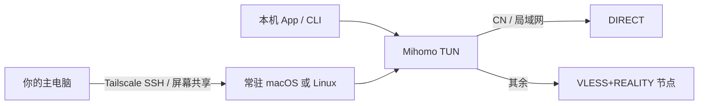

# 常驻 macOS / Linux 客户端（迷你机场景）

把一台长期开机的电脑当成「家里的代理入口」：本机进程走 Mihomo 规则分流 + TUN，命令行不必每次手动开代理；同时用 Tailscale 做远程管理。这套在 **macOS 和 Linux 都能用**，内核都是 Mihomo（Clash Meta）。

> 公开仓库只写结构，不写订阅、UUID、公钥、短 ID、家庭公网 IP。把真实节点放在本机 `0600` 配置里。

## 它解决什么

笔记本合上就睡、命令行忘了设 `http_proxy`、Linux 没有微信开发者工具——这些都可以拆开处理：

| 需求 | 做法 |
| --- | --- |
| 浏览器 + `curl`/`git` 都走规则 | Mihomo **TUN**（不要只开系统代理） |
| 国内直连、境外走 REALITY | `mode: rule` + `GEOSITE/GEOIP,CN,DIRECT` + `MATCH,PROXY` |
| 局域网和 Tailscale 不被代理吞掉 | `inet4-route-exclude-address` 排除 `192.168.0.0/16` 和 `100.64.0.0/10` |
| 人不在旁边也能管机器 | Tailscale + SSH；需要桌面时再用系统屏幕共享 |
| 长期插电、少耗屏幕 | 显示器尽快休眠；MacBook **合盖仍会睡**，见下文 |

不要用 UU / ToDesk 这类常驻推流做迷你机远程：它们会把老 Intel Mac 的 CPU 打满。系统屏幕共享只在有人连上时编码。

## 拓扑



和家庭路由器透明代理是同一策略、不同抓包点：路由器用 TPROXY/dnsmasq，这台迷你机用 TUN。

## macOS

### 为何能和 Tailscale 并存

TUN 的 `auto-route` 会铺很多宽网段；Tailscale 的 `100.64.0.0/10` 更长、更优先，所以 `100.x` 仍走 Tailscale。再在配置里显式排除，避免误伤：

```yaml
tun:
  enable: true
  auto-route: true
  auto-detect-interface: true
  stack: gVisor
  dns-hijack:
    - any:53
    - tcp://any:53
  inet4-route-exclude-address:
    - 192.168.0.0/16
    - 100.64.0.0/10
```

系统代理（`HTTP/SOCKS → 127.0.0.1:mixed-port`）**管不到** `curl`/`git`。TUN 开着时不必再设环境变量。

### 权限

图形版 ClashX Meta 靠 **PrivilegedHelper** 以 root 建 utun。老 macOS（例如 Big Sur）装不了当前 ClashX Meta 时，改用官方/GitHub 的 `mihomo` 二进制，用 **LaunchDaemon（root）** 跑，不要只用用户 LaunchAgent。

用户 LaunchAgent 开 `tun.enable: true` 通常建不了 utun。

验收（不要用 `ping`）：

```bash
curl -s --max-time 15 --noproxy '*' https://www.gstatic.com/generate_204
# 国内直连站应仍可开；被墙站应经代理
```

### 远程

- SSH：系统「远程登录」+ Tailscale 网卡。
- 桌面：系统「屏幕共享」。若勾了「远程管理」，屏幕共享会被 ARD 占用且 **VNC 端口可能不是 5900**。只要一对一连桌面，关掉远程管理，只开屏幕共享。
- 部分系统 `/etc/services` 把 `rfb/vnc-server` 标成 **6900**。Finder 默认连 5900 会失败，应使用 `vnc://<tailscale-ip>:6900`。

### 电源、屏幕、电池（MacBook 当迷你机）

Mac Mini 没有屏幕、没有笔记本电池，所以没有这两件事。MacBook **不能改成「电源直供、电池完全不参与」**：充电回路仍经过电池。插着电可以避免循环放电；长期 100% 浮充仍会慢慢老化。目标是少循环、少亮背光，而不是假装没有电池。

插电 / 拔电应分开设（需管理员）：

```bash
# 充电器：系统不睡，约 1 分钟关背光，掉电后自动开机
sudo pmset -c sleep 0 displaysleep 1 disksleep 10 halfdim 1
sudo pmset -c autorestart 1
# 电池：尽快睡，免得没电硬扛
sudo pmset -b sleep 15 displaysleep 1 disksleep 5
```

核对：

```bash
pmset -g custom     # AC Power 应 sleep=0、displaysleep=1；Battery 应 sleep=15
pmset -g batt       # 应显示 Now drawing from 'AC Power'
pmset -g assertions # 不要出现 PreventUserIdleDisplaySleep 来自 caffeinate
```

`caffeinate` 若用来保活，只用 `-is`（防空闲睡 / 插电系统睡）。**不要加 `-d`**：`-d` 会阻止关屏，背光会一直亮。远程桌面连着时 `screensharingd` 也可能暂时挡住关屏，断开会话后应能暗下去。

合盖：

| 做法 | 结果 |
| --- | --- |
| 官方蛤壳模式 | 外接显示器 + 电源 + 键鼠，合盖不睡 |
| 无外接屏合死盖 | 默认仍会睡 |
| 盖子留缝 / 支架微开（推荐） | 背光可关，机器继续跑，散热比合死好 |
| `sudo pmset -c disablesleep 1` | 仅充电器上禁止睡，更热，**禁止放进包里** |

屏幕损耗主要来自背光。`displaysleep 1` 关背光，就接近 Mini「没屏幕」。不要为了远程好看把亮度锁在最高。

## Linux

同样用 Mihomo 官方包或静态二进制 + systemd：

```ini
# /etc/systemd/system/mihomo.service 示例意图
[Service]
ExecStart=/usr/local/bin/mihomo -d /etc/mihomo
Restart=always
```

Linux 上 TUN 通常直接有权限，不必 ClashX Helper。排除网段、规则分流与 macOS 相同。远程用 Tailscale SSH 即可，一般不需要 VNC。

## Agent / 人的操作清单

1. 只读确认：进程用户（应为 root/systemd）、TUN 设备、`inet4-route-exclude-address`、Tailscale 地址仍可达。
2. 候选配置放 `0600` 文件，不含进 Git。
3. `mihomo -t -d <dir>` 校验后原子切换，失败回滚。
4. 冒烟：直连站、代理站、Tailscale SSH、局域网；不要用 ICMP 判断代理。
5. 开机：LaunchDaemon 或 systemd `Restart=always`。

## 明确不要做的

- 把订阅或节点写进公开文档、cron 明文、截图。
- 在已开 Tailscale 的机器上开 UU 类常驻推流。
- 用 `ping` 验收 Mihomo/TUN。
- 未排除 `100.64.0.0/10` 就把默认路由全交给 TUN，再抱怨 Tailscale 断了。
