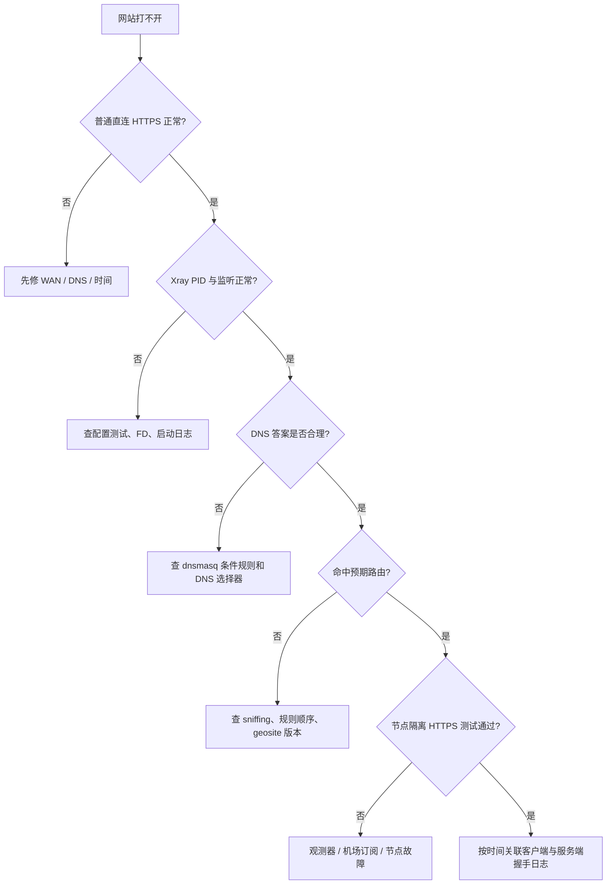
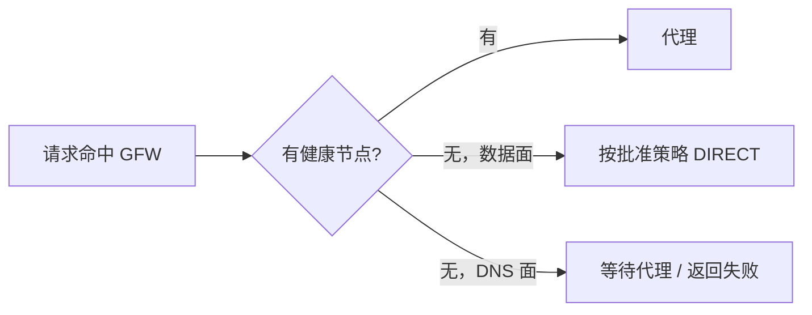
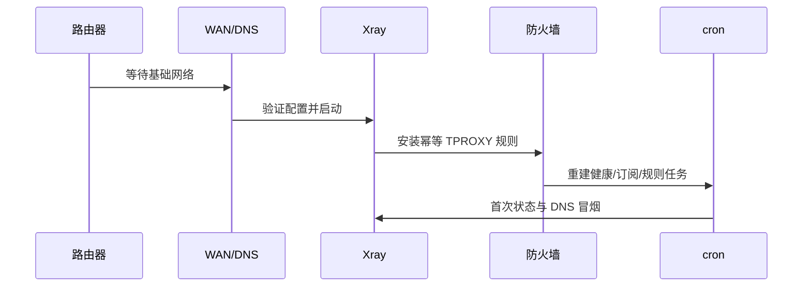

# 诊断、验收与日常维护

这份文档面向实际使用者：日常只需要几个状态命令；出故障时按层排查，不要一上来重刷路由器或改节点参数。

## 为什么 ping 不能证明代理坏了

HTTP/SOCKS 代理一般不转发 ICMP，`ping` 失败是正常现象。应该发送真实 HTTP 请求：

```bash
# 直连基线
curl -fsS --max-time 10 https://api.ipify.org >/dev/null

# HTTP 代理
curl -fsS --max-time 10 -x http://127.0.0.1:10809 \
  https://api.ipify.org >/dev/null

# SOCKS，域名也通过代理解析
curl -fsS --max-time 10 --socks5-hostname 127.0.0.1:10810 \
  https://api.ipify.org >/dev/null
```

不要把命令输出的真实公网 IP 贴进公开 issue。

## 日常控制面

部署完成时应该得到这些等价操作（实际脚本名可以不同）：

```text
control status                # PID、监听、FD/RSS、最近测试
control proxy                 # 安装本项目透明代理规则
control direct                # 仅移除本项目规则，保持 WAN/LAN
control restart               # 验证当前配置后重启
control logs                  # 查看经过脱敏和限长的近期错误
control update-subscription   # 手动触发安全订阅检查
control update-rules          # 手动触发安全规则检查
control rollback              # 恢复上一版并做冒烟
```

`direct` 不能清空整个防火墙；它只移除本项目命名链和策略路由。这样代理出故障时，家庭网络仍能普通直连。

## 五分钟状态检查

每次只看结论和计数，不打印配置秘密：

- WAN 是否有地址、默认路由和可用 DNS；
- Xray PID 是否存在，TPROXY/DNS 端口是否监听；
- 当前 FD / 上限、RSS、JFFS 剩余空间；
- 最近一次节点探测、订阅检查、规则更新结果；
- 当前配置和上一版配置的短哈希；
- 数据模式是 proxy、direct 还是临时 fail-open；
- GFW DNS 是否仍为 proxy-only。

## 故障决策图



### 只有一个网站失败

先比较该域名是否进入 GFW 列表、DNS 是否污染、浏览器是否缓存旧 IP、是否用了 ECH/QUIC。临时加入本地覆盖规则验证，不要立刻改整套模式为全局代理。

### 所有代理网站失败，直连正常

检查 Xray 进程和监听、节点观测结果、机场订阅是否过期、文件描述符、系统时间。逐节点隔离测试真实 HTTPS，不要只测 TCP 端口。

### 重启后短暂污染 DNS

重点检查 DNS 专用选择器是否在观测器冷启动时回退了 direct。修复为固定代理或代理池内回退，重启 dnsmasq/Xray 后清除客户端 DNS 缓存。

### REALITY 日志出现 invalid connection

公网端口会收到扫描，单独的 `handshakeStatus: false` 或 `processed invalid connection` 不能证明伪装目标封了 IP。先用请求时间对齐客户端和服务端，检查 UUID、密钥、short ID、SNI、flow、transport 和两端时间。

只有在同一客户端和凭据下，仅更换经过验证的 target/SNI 后稳定恢复，旧目标又能稳定复现失败，才把目标兼容性作为已确认原因。修改时使用候选配置和回滚，不能直接 `sed -i` 改线上 JSON。

## 代理挂掉时会发生什么



数据 fail-open 是稳定性选择：能直连的网站仍可访问；被墙网站会失败，但不会拖垮整个家庭网络。DNS 不直连回退是正确性选择：宁可该查询暂时失败，也不要把污染地址缓存给所有设备。

## 开机自动恢复应该包含什么



仅看到进程在开机启动不够。cron 可能存在于临时文件系统，防火墙也会在 WAN 重连时重建，因此 init、firewall、wan-up 都要调用持久化脚本并保持幂等。

## 每月维护

正常情况下只看一份摘要：

- 规则 release 与哈希是否更新成功；
- 订阅最近检查时间、源是否变化、通过验证的匿名节点数量；
- FD/RSS 趋势是否持续增长；
- JFFS 使用量与日志轮转是否正常；
- 上一次整机启动验收是否通过；
- 是否仍只有一个机场控制面，独立备用节点是否可用。

月度重启可作为低成本保守措施，但不能代替内存/FD 监控。若运行稳定、资源无增长，也可以不重启。

## 安全更新失败时

正确表现是：

1. 候选被拒绝；
2. 当前配置继续运行；
3. 日志只记录匿名节点名、步骤、错误和哈希；
4. 下一次计划任务自动重试；
5. 不无限累积下载文件。

如果更新脚本失败后路由器反而断网，说明它没有做到候选隔离或原子切换，应先切 direct 恢复家庭网络，再恢复 `.prev` 并修脚本。

## 安全恢复顺序

```text
保留错误证据（脱敏）
→ 只移除项目 TPROXY 规则
→ 确认 LAN 管理和 WAN 直连
→ 恢复上一版配置/规则
→ 用目标 Xray 二进制验证
→ 启动 Xray 并重装项目规则
→ 重测普通 DNS、GFW DNS、直连和代理
```

若订阅 URL、UUID 或密钥曾出现在公开日志/Git 中，应立即轮换。删除最新文件并不能从 Git 历史和已有克隆中收回秘密。

## 完整验收表

| 项目 | 通过标准 |
| --- | --- |
| 管理 | LAN 打开路由器 UI，SSH 正常 |
| WAN | direct 模式可访问普通 HTTPS |
| Wi-Fi | 2.4/5 GHz 与 DHCP 正常 |
| 直连分流 | 国内/未命中域名不经过节点 |
| GFW 分流 | 命中域名经过健康节点 |
| DNS | 普通域名直连解析，GFW 域名代理解析 |
| 单节点故障 | 自动换健康节点，Xray 不重启 |
| 全节点故障 | 数据按 fail-open，GFW DNS 不直连回退 |
| 候选失败 | 当前服务不受影响 |
| 服务重启 | 分流和 DNS 行为不变 |
| 整机重启 | WAN、Wi-Fi、Xray、规则、cron 自动恢复 |

更详细的 Agent 验收步骤见 [verification-runbook.md](../references/verification-runbook.md)。
