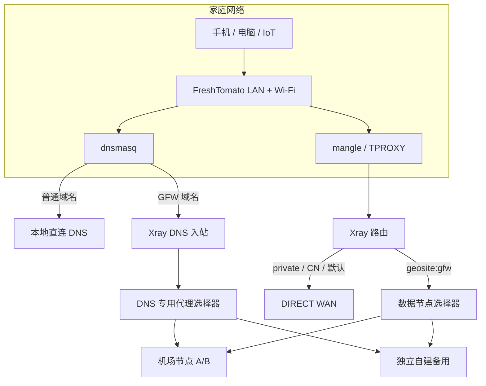
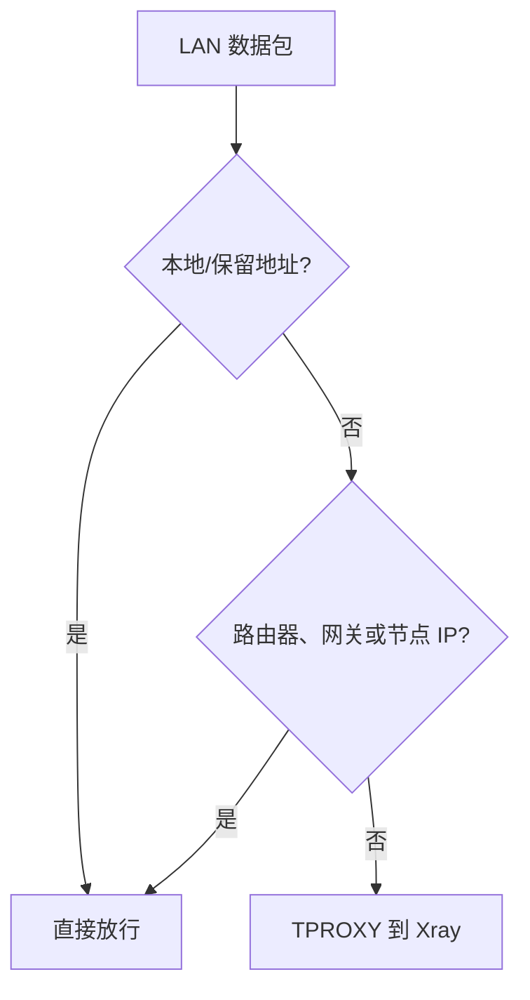
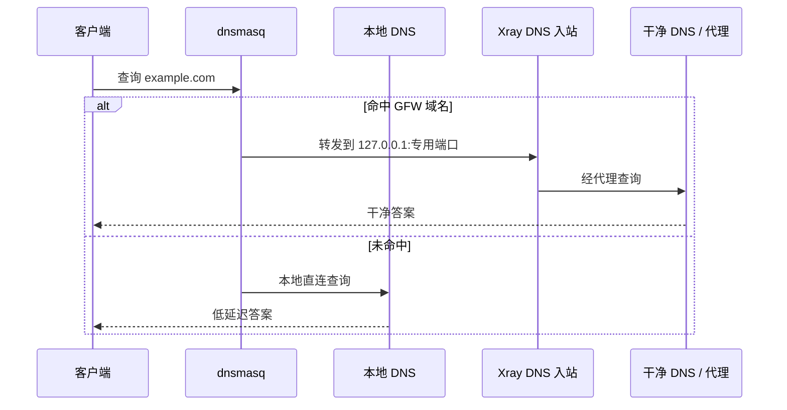
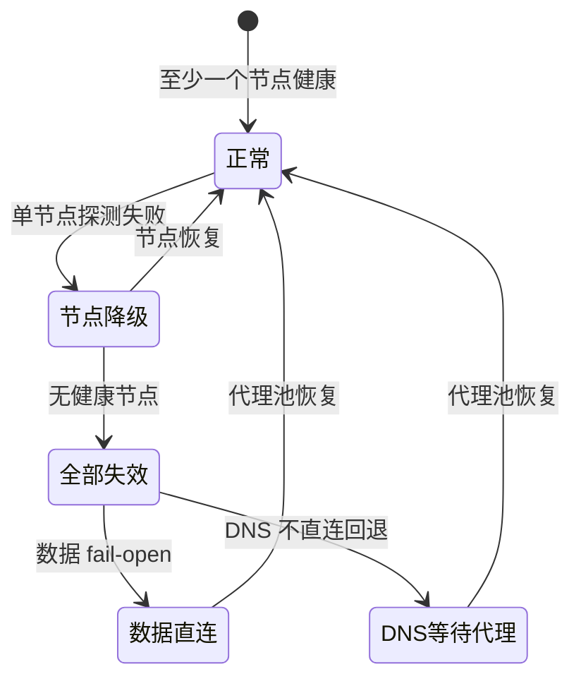

# FreshTomato 家庭路由器完整方案

这份指南解释一套适合老 ARM 路由器的日常方案：Wi-Fi 和普通上网由 FreshTomato 保持，Xray 只接管需要代理的流量；国内及未命中域名直连；多个节点自动选择；更新失败不破坏当前配置。

它不是可直接粘贴的秘密配置。接口名、网段、Xray 版本、节点字段必须先在目标设备上确认。

## 目标与边界

目标：

- 家里手机、电脑、电视无需逐台装客户端；
- 只有 GFW List 命中的网站走代理；
- 普通 DNS 直连，被墙域名 DNS 走干净代理；
- 节点故障时自动选择其他节点；
- 数据节点全挂时允许直连，优先保证家里“还有网”；
- 更新按候选事务执行，失败自动回滚；
- 重启路由器后自动恢复。

边界：

- GFW List 有延迟，不可能实时覆盖每个新域名；
- 一个机场里的多个节点仍可能一起失效；
- 老路由器的 CPU、内存、内核和 Wi-Fi 驱动决定吞吐上限；
- fail-open 会让原本需要代理的请求尝试直连，这提高可用性，但不等于隐私优先的 fail-closed。

## 总体架构



## 为什么不升级 Linux 2.6.36

FreshTomato 的内核、交换芯片、Broadcom Wi-Fi 驱动和启动镜像是绑定的。单独替换内核不是普通软件升级，极容易失去无线、交换或启动能力。只要 TPROXY、mangle、策略路由和可用的 Xray 二进制都存在，就没有必要为这套方案升级内核。

如果缺少关键能力，更稳妥的上限提升是换支持新内核/OpenWrt 的硬件，把旧路由器保留为 AP 或应急设备。

## 第一步：只读能力审计

至少确认：

```bash
uname -a
cat /proc/cpuinfo
df -h
cat /proc/meminfo
iptables -V
iptables -t mangle -S
ip rule show
ip route show table all
ulimit -n
```

还要记录管理 IP、LAN bridge、WAN 接口、默认网关、DNS、JFFS 空间和有线恢复方式。改防火墙之前必须能用网线进入管理页或 SSH。

不要只根据 `ARMv7` 下载二进制。测试 `xray version`、最小配置和一个隔离的代理请求；出现 `Illegal instruction` 就换更保守的构建。旧 ARM CPU 上，ARM32 v5 有时比名义上的 ARMv7 构建更兼容。

## 第二步：透明接管数据流

TPROXY 方案需要三个配合部分：

1. Xray 监听一个透明代理入站，接收 TCP/UDP；
2. iptables mangle 给 LAN 流量打标并送入该端口；
3. `ip rule` 与本地路由把打标流量交回本机。

规则最重要的是“先排除，再接管”：



排除回环、局域网、链路本地、组播、广播、管理地址、WAN 网关、全部节点 IP 和 Xray 自身连接，否则容易出现路由环路或管理页失联。

脚本只能创建和清理自己的链，不能 `iptables -t mangle -F` 清空整个表。每次应用必须幂等，启动多次也不能累加重复规则。

## 第三步：GFW List 路由

推荐顺序：

```text
private/local                 → direct
DNS 专用入站                  → 对应 DNS 出站
geosite:gfw                   → proxy-balancer
geosite:cn / geoip:cn         → direct
未命中                        → direct
```

Xray 使用第一条命中规则。最后一条默认直连正是“只代理被墙网站”，并不是“所有国外网站代理”。

`sniffing` 能从 HTTP/TLS 流量里看到域名，用于匹配 geosite；浏览器使用 ECH、应用直接连 IP、或非标准协议时可能看不到域名。因此 DNS 和本地补充规则仍然重要。

### 新被墙域名尚未进列表怎么办

保留一个小型、人工维护的本地覆盖文件，优先级放在生成列表之前。发现漏网域名时先加入覆盖，不必等待月度更新；确认上游可信列表收录后再删除覆盖。

“直连失败后自动改走代理”看似简单，实际上 DNS、TCP/TLS、UDP/QUIC 都有各自状态，透明重试可能造成重复请求或隐私问题。黑名单 + 本地覆盖更可控。

## 第四步：分流 DNS

全量 DNS 走代理会增加普通网站延迟，也会浪费节点流量。更适合日常的是 dnsmasq 条件转发：



数据选择器可以在所有节点失效时回退直连，但 DNS 专用选择器不行。观测器刚启动、尚未完成首轮探测时也可能没有健康分数；DNS 选择器要么固定回退到一个代理节点，要么只在代理池内部回退。

如果修复路由器后电脑仍访问旧污染 IP，先清 DNS 缓存或断开重连 Wi-Fi。Xray 的 `routeOnly` 只决定路径，不会把客户端已经拿到的错误目的 IP 改正确。

## 第五步：多节点容灾

Xray 现成组件可以完成：

- `observatory` 定期用 HTTP 204 探测出站；
- `leastPing` 等策略在健康节点中选择；
- `fallbackTag` 在没有可用节点时执行预设策略。



探测周期 15 分钟到 1 小时都合理。节点少、流量敏感可用 1 小时；希望更快切换可用 15 分钟。先测一次探测响应实际字节数，再估算全年流量。

机场节点彼此再多，也可能共享订阅、账号和控制面。未来添加自建节点时优先选择不同提供商/ASN/地区，并避免在正常日志里频繁探测或打印这个备用节点的真实地址。

## 第六步：安全更新

订阅刷新：每天检查源哈希，未变化立即退出；变化后在 `/tmp` 解码，白名单筛选兼容的 VLESS+REALITY 节点，逐个用隔离本地入站发起 HTTPS 请求；通过后才生成候选、执行 `xray run -test`、原子切换和 DNS/代理冒烟；失败恢复上一版。

规则刷新：每天只判断是否到月度窗口；到期才拉取同一个 release tag 下的文件，验证发布摘要、大小、行数、哨兵域名和变化比例，再测试候选 geodata。上游没有某个 `.sha256sum` 资产时不能猜文件名，应读取可信 release digest 或停止更新。


## 启动、健康和定时任务

建议的低维护节奏：

| 项目 | 周期 | 失败处理 |
| --- | --- | --- |
| 进程健康 | 5 分钟 | PID/监听/FD/RSS 异常才重启 |
| 节点探测 | 15–60 分钟 | 选择其他节点，不重启进程 |
| 订阅检查 | 每天 | 不变不重启；候选失败保留当前版 |
| 规则检查 | 每天 | 只有月度到期才下载 |
| 规则更新 | 每月成功一次 | 校验、切换、冒烟、回滚 |
| 维护重启 | 每月，可选 | 有启动验收与锁后才启用 |

FreshTomato 的 init/firewall/wan-up 入口只调用 `/jffs` 下的短脚本。完整规则不要塞进 NVRAM。启动时等待 WAN 与 DNS 可用，再启动 Xray、安装幂等防火墙、重建 cron。

所有更新和重启共享一个锁，避免月度规则更新、订阅更新和健康脚本同时改配置。

## 存储与日志

- 配置、geosite 和生成 DNS 文件只保留当前 + 一个 `.prev`。
- 订阅 URL 文件权限 `0600`，候选配置同样 `0600`。
- 正常运行关闭 access log；error/console log 必须轮转或限制大小。
- 提高 Xray 进程 FD 上限，并检查 `/proc/<pid>/limits` 确认实际生效。
- 不把订阅 URL、节点 URI、UUID、密钥、真实公网 IP 写入文档和健康日志。

## 最终验收

完成不等于“进程启动”。必须验证：管理页与 SSH、WAN 直连、普通域名直连、GFW 域名代理、两类 DNS、服务重启、单节点故障、全部节点故障的 fail-open、候选失败回滚，以及安全条件允许时的整机重启。

详细操作清单见 [诊断、验收与日常维护](./operations.zh-CN.md)。
