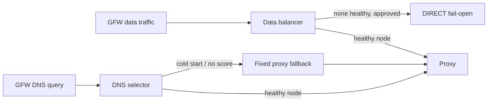
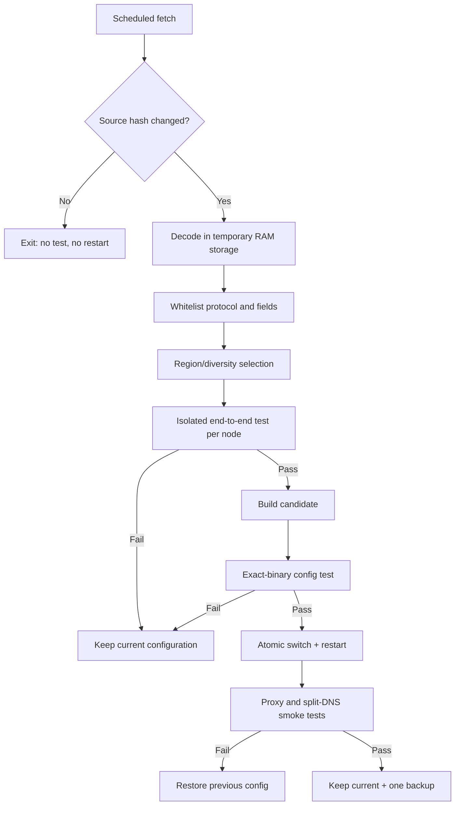

# Resilience, subscriptions, and unattended updates

Use this runbook when a router has multiple nodes, an airport subscription, scheduled rule-data updates, or an explicit fail-open requirement.

## Failure domains first

Multiple nodes from one subscription improve endpoint availability but do not remove a shared control-plane, account, provider, ASN, billing, or legal-region failure. Classify each candidate by provider, ASN/network, region, protocol, credentials, and subscription source.

For meaningful resilience, prefer diversity across at least provider/control plane and network/region. Do not expose the rarely used self-hosted node in routine logs, tests, or generated public documentation.

## Two selectors, two failure policies

Do not reuse one balancer for both ordinary traffic and clean DNS.



- Data plane: an `observatory` can probe candidate outbound tags, and a routing balancer can select a healthy/low-latency outbound. An explicit `fallbackTag: direct` implements availability-first fail-open when supported by the deployed Xray version.
- DNS plane: fallback must remain proxy-only. A direct fallback can return a polluted destination during startup or an observatory cold state; later routing cannot repair the destination IP already given to the client.

Xray routing is first-match. `leastPing` and similar observatory-backed strategies depend on successful probes and supported version semantics. Confirm behavior with the installed binary rather than assuming current documentation matches it.

## Probe economics

HTTP observatory checks consume small but nonzero bandwidth and can loop through transparent interception if process traffic is not excluded.

Pick a probe interval based on the number of nodes and failure-recovery target:

- one hour: low traffic, slower detection;
- fifteen minutes: reasonable for a small daily-use pool;
- five minutes: faster recovery, proportionally more traffic.

Estimate annual traffic using the actual response size and node count. Use a stable HTTP 204 endpoint, ensure probe traffic leaves through the intended outbound, and avoid logging full URLs that contain secrets.

## Subscription URL handling

A subscription URL is a bearer credential. Store it in a dedicated `0600` file, for example:

```text
/jffs/xray/secrets/subscription.url
```

Never put it in:

- Xray logs or process arguments;
- cron command text if cron is world-readable;
- Git history, screenshots, issue reports, or shell debug output;
- generated documentation.

Use a wrapper that reads it from the protected file with shell tracing disabled.

## Safe subscription refresh



### Parse defensively

Treat the response as untrusted input. Enforce:

- response size and timeout limits;
- expected encoding and scheme;
- a whitelist of protocols supported by the exact router binary;
- for a REALITY-only pool: VLESS, REALITY security, supported transport, nonempty endpoint/port/UUID/SNI/key/short ID;
- valid port ranges and JSON/string lengths;
- unique endpoint selection where possible;
- a maximum node count.

Never evaluate decoded text as shell. Construct JSON with a real JSON encoder or a narrowly reviewed renderer. Do not copy provider-supplied arbitrary JSON fields into the live configuration.

### Test nodes independently

A successful TCP connect is insufficient. For each candidate:

1. create a temporary config containing only that outbound and an isolated loopback HTTP/SOCKS inbound;
2. validate with the exact Xray binary;
3. start it with private logs and a strict timeout;
4. request an HTTPS test endpoint through that inbound;
5. require a valid response and record only a node alias/result/latency;
6. stop the process and remove the temporary config.

Select only nodes that pass. A useful small pool may include different nearby regions and unique server addresses, but redact all endpoint details from public output.

### Switch and rollback

Use same-filesystem rename for the candidate and current configuration. Preserve only one previous known-working version. After restart, test:

- process and listeners;
- a proxied HTTPS request;
- a direct-domain DNS response;
- a GFW-domain clean DNS response;
- one direct and one proxied website.

If any required test fails, restore the previous config and restart. The updater itself should return nonzero and leave an actionable redacted log.

## Rule-data refresh

For geosite/GFW inputs, prefer a published release from a maintained source such as [Loyalsoldier/v2ray-rules-dat](https://github.com/Loyalsoldier/v2ray-rules-dat). Pin all assets to one resolved release tag to avoid a release changing between API lookup and download.

Validation should include:

- release tag and asset name allowlist;
- published SHA-256 or release digest when available;
- minimum/maximum size;
- expected line count and sentinel domains for text lists;
- a bounded percentage change compared with the current list;
- exact-binary configuration test using candidate geodata;
- DNS/routing smoke tests after the switch.

Do not invent checksum asset names. Some GitHub release assets expose a digest in the API rather than a separate `.sha256sum` file. If no trustworthy digest is available, stop or require a separately authenticated source.

Run a lightweight daily eligibility check and perform the full download only when the configured monthly window is due or the previous attempt failed. This makes missed cron windows recoverable without downloading the full asset every day.

## Scheduling model

A low-maintenance example:

| Job | Frequency | Behavior |
| --- | --- | --- |
| process health | every 5 minutes | PID/listener/RSS/FD; restart only process failures |
| outbound probe | every 15–60 minutes | Xray observatory; small HTTP 204 |
| subscription refresh | daily | conditional GET/hash; no restart if unchanged |
| rule eligibility | daily | download only when monthly update is due |
| rule refresh | monthly successful update | validate, atomic switch, one backup |
| maintenance restart | monthly, optional | only with boot/recovery tests and locks |

Add jitter so many devices do not fetch at the same minute. Use one global mutation lock around config, rules, restart, and rollback.

## Health escalation

Distinguish node failure from process failure:

- one node fails: observatory removes it from selection;
- every node fails but Xray is healthy: apply the user's data fail-open/closed policy; keep GFW DNS proxy-only;
- PID/listener fails: restart Xray;
- repeated process/config failures: restore the known-good config, temporarily disable transparent interception if approved, and keep LAN/WAN available;
- storage full or checksum failure: do not mutate; alert with redacted evidence.

## Manual operations to provide

Every deployment should expose a small control surface:

```text
control status
control proxy
control direct
control restart
control logs
control update-subscription
control update-rules
control rollback
```

Names may differ, but each operation must be idempotent and documented. `direct` should remove only the project's interception rules, not flush the firewall.
