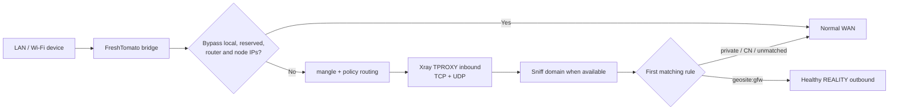
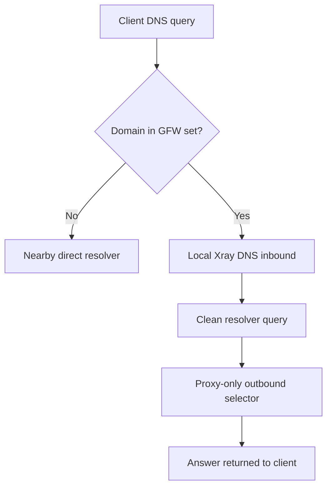
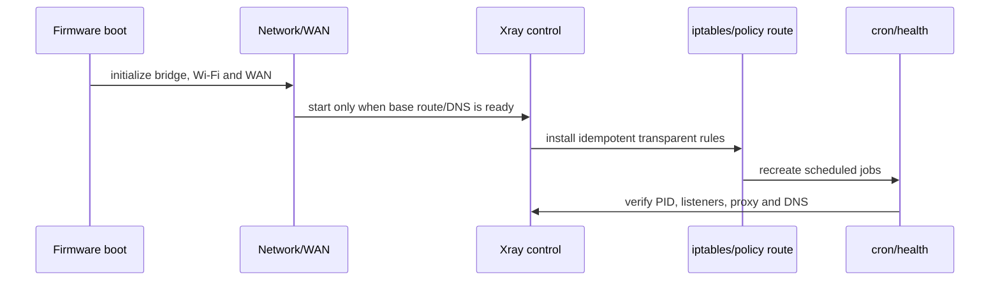

# Embedded-router deployment

Use this runbook for FreshTomato and similar embedded Linux routers that must retain normal Wi-Fi/LAN service while transparently routing selected household traffic through Xray.

## Platform ceiling and capability audit

Do not treat the kernel version as the only limit. The practical ceiling is the combination of kernel/netfilter modules, libc, CPU instruction set, firmware tools, persistent storage, RAM, flash wear, and recovery access.

Start read-only:

```bash
uname -a
cat /proc/cpuinfo
df -h
free 2>/dev/null || cat /proc/meminfo
iptables -V
iptables -t mangle -S 2>/dev/null
ip rule show 2>/dev/null
ip route show table all 2>/dev/null
ulimit -n
nvram show 2>/dev/null | grep -E 'script_(init|fire|wanup|shut)' | sed 's/=.*$/=<redacted>/'
```

Verify JFFS or other persistent storage is enabled and backed up. Confirm wired recovery before changing bridging, VLAN, WAN, DHCP, or Wi-Fi settings.

### Select the binary empirically

Architecture labels are not enough on older ARM routers. A nominal ARMv7 build can contain instructions the CPU cannot execute.

For each plausible static build:

1. verify the release checksum on a trusted workstation;
2. copy it to a temporary router path;
3. run `xray version`;
4. run a minimal configuration test;
5. start an isolated loopback inbound and make one request;
6. keep the least demanding build that passes all tests.

An `Illegal instruction` result is a definitive incompatibility for that binary. In one RT-AC66U B1/FreshTomato deployment, an ARM32 v5 build worked where another ARMv7 build did not; treat this as an example, not a universal mapping.

## Suggested persistent layout

```text
/jffs/xray/
├── bin/xray
├── config/config.json
├── config/config.json.prev
├── data/geosite.dat
├── data/geosite.dat.prev
├── data/geoip.dat
├── secrets/subscription.url     # 0600, optional
├── scripts/control.sh
├── scripts/firewall.sh
├── scripts/health.sh
├── scripts/update-rules.sh
├── scripts/update-subscription.sh
├── run/
└── logs/
```

Keep only current and one previous large rule/config file. Do not retain an unbounded history on flash.

## Packet path



## Transparent proxy invariants

TPROXY supports both TCP and UDP when the kernel and iptables target are available. A typical design uses:

- a dedicated Xray TPROXY inbound;
- a packet mark and matching `ip rule`;
- a local route for marked packets;
- a dedicated mangle chain applied to LAN-origin traffic;
- exclusions before the TPROXY rule.

Exclude at least:

- loopback, link-local, multicast, broadcast, RFC1918/ULA networks;
- the router management address and LAN subnet as appropriate;
- the WAN gateway;
- all proxy server IPs to prevent routing loops;
- the Xray process's own traffic by a supported owner/GID/cgroup or explicit endpoint bypass strategy.

Do not paste a universal iptables script without mapping the firmware's bridge, WAN, and LAN interfaces. Save the current `iptables-save`, `ip rule`, and route output before applying a candidate firewall script.

The firewall script must be idempotent: create/flush only its own named chains and rules, never flush unrelated tables.

## Blocked-only routing policy

For “only sites known to be blocked use the proxy,” use ordered semantics:

1. private/local traffic → direct;
2. DNS inbounds → their explicit DNS path;
3. `geosite:gfw` → proxy selector;
4. `geosite:cn` and `geoip:cn` → direct;
5. unmatched → direct.

Xray evaluates routing rules top to bottom and uses the first match. A catch-all placed earlier makes later rules unreachable.

This policy is intentionally dependent on the GFW list. It may miss a newly blocked domain until the list updates. Document how the user can add a local override immediately without editing generated data.

With transparent interception, sniffing can expose HTTP/TLS domains for routing. `routeOnly` affects route selection but does not rewrite an already polluted destination IP. Correct DNS is therefore part of routing correctness.

## Split DNS

Use dnsmasq as the LAN resolver:



Generate dnsmasq conditional-forward rules from a verified GFW source. Reload dnsmasq only after syntax/size/sentinel checks pass. Keep a previous generated file and restore it on failed resolution tests.

If Xray's built-in DNS on the deployed binary exhibits unresolved pending requests or other repeatable failures, prefer the smaller stable design: dnsmasq conditional forwarding to a loopback Xray DNS inbound. Do not assume a newer documented DNS field works on an older binary.

Test answers, not only port 53:

- direct domain returns quickly through the direct resolver;
- GFW domain returns a plausible answer through the clean path;
- proxy restart does not silently cause GFW queries to fall back to direct DNS;
- client cache is flushed before retesting a formerly polluted name.

## Boot integration

FreshTomato normally exposes init, firewall, and WAN-up script hooks through NVRAM. Keep those entries short: each should invoke a versioned script under persistent storage, not embed the full firewall or configuration.

Desired order:



Use a lock to avoid two init/health/update scripts mutating state simultaneously. Recreate cron entries idempotently on boot because `/tmp` cron state may not persist.

## Runtime limits

- Raise the Xray process file-descriptor limit where the shell/firmware permits; record both the requested and observed limit.
- Disable access logging for normal operation. Rotate or cap error/console logs so JFFS cannot fill.
- Monitor PID, required listeners, RSS, open FD count, config hash, and last successful proxy/DNS test.
- Restart the process only for process/config failure. Let the outbound observatory handle a single dead node.
- Consider a monthly maintenance restart only after health monitoring exists; scheduled restarts are not a substitute for leak evidence.
- Batch SSH commands on firmware with aggressive brute-force limits instead of opening many sessions quickly.

## Kernel upgrades

An embedded router kernel is normally coupled to the firmware's proprietary drivers and boot image. Replacing only Linux 2.6.x is not a routine package upgrade and can break Wi-Fi, switching, or boot. If required netfilter features are missing, choose a firmware/hardware platform that supports them rather than attempting an in-place kernel transplant on the daily router.
