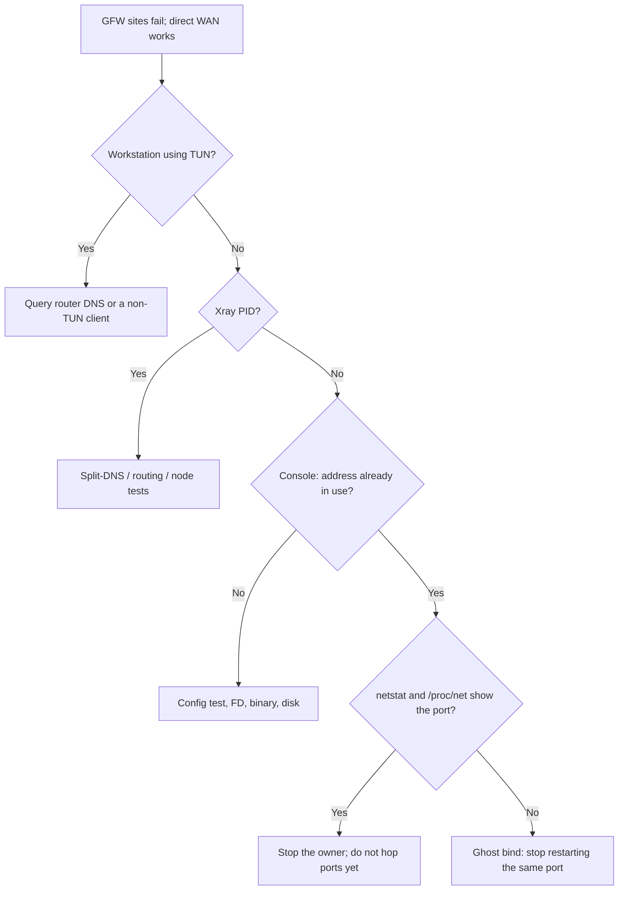

# TPROXY ghost sockets on old kernels

Use this when an embedded-router transparent proxy stays down for a long time, health checks keep restarting Xray, and the console repeats `bind: address already in use` even though no process owns the port.

This is a control-plane failure mode. It is not a Reality handshake problem and it is not proof that the subscription or binary is broken.

## Observed pattern

A typical incident looks like this:

| Layer | What you see | What it does *not* prove |
| --- | --- | --- |
| Process | no Xray PID; health fail counter in the thousands | the config is invalid |
| Console | `listen tcp 0.0.0.0:<port>: bind: address already in use` | a user-visible process holds the port |
| Listeners | busybox `netstat -ln` and `/proc/net/{tcp,tcp6,udp,udp6}` have no matching port | the kernel is free |
| Config test | `xray run -test` reports Configuration OK | listeners can bind |
| Same binary, other port | a different TPROXY port listens within a few seconds | Xray or geodata is corrupt |
| LAN DNS | GFW names resolve to polluted answers | the WAN uplink is down |
| Laptop browser | Google still works | the router transparent path is healthy |

The working hypothesis on Linux 2.6.x plus TPROXY is a **ghost socket**: after SIGKILL the kernel can keep the TPROXY bind reserved. BusyBox tools on that firmware often cannot show it. Treat the hypothesis as operationally useful, not as a kernel proof. You do not need `ss -K` to justify an escape hatch.

Do not treat nearby outbound `no such host` lines as the bind cause. Xray resolving node hostnames through `127.0.0.1:53` (dnsmasq) is a separate fragility. It can kill observatory probes; it does not by itself create `EADDRINUSE`.

## Diagnostic pitfalls

1. **A laptop TUN client that excludes RFC1918 is a bad oracle.** Direct browser success only tests that workstation. Query the **router DNS** (`dig listed-gfw-name @<lan-gateway>`) or use a LAN client that is not in TUN mode.
2. **Router `wget`/`curl` does not use LAN TPROXY.** A design that intercepts only `-i br0` leaves the router itself on the unproxied WAN. Subscription and geosite updates can time out while LAN proxying is also dead, or even while LAN proxying is healthy but the WAN target is blocked. Log those failures; do not assume they measure the transparent path.
3. **busybox `netstat` is incomplete.** Dual-stack listen often appears as `:::PORT`. Match `':PORT '`, and also search `/proc/net/tcp*` / `udp*` for the four-digit hex port. `nc -l` on these images can bind without showing up in `netstat`; do not use it as a control experiment.
4. **`config.json` mtime is not a restart signal.** A refresh script that rewrites an unchanged candidate will still bounce Xray and raise the chance of another leaked TPROXY socket.

## Required control-plane behavior

Health loops that `kill` + `bind` the same TPROXY port every five minutes will not recover from a ghost socket. After three failures they often disable interception (`direct`) and stay there silently if syslog is quiet.

Ship all of the following:

1. **Single source of truth for the TPROXY port.** A small persistent file (for example `/jffs/xray/tproxy-port`) must be read by start, health, firewall, and any subscription renderer. Hard-coding the port in the refresh template will revert a hot-fix at 03:47.
2. **Failed start must reap the child.** `xray run -test` then background `xray run` that fails to listen must be stopped. Leaving a half-started process plus a pidfile pointing at a dead PID makes the next attempt worse.
3. **EADDRINUSE escape, once per start.** If the recent console contains `address already in use` and the configured port is not visible in netstat/`/proc/net`, switch to the next pre-declared candidate, rewrite only the `tproxy-in` port in a staged config, `xray run -test`, persist the new port, refresh the TPROXY chain, and retry **once**. If the list is exhausted, set mode to `stuck` and stop hammering.
4. **Do not return to a port that already ghosted** unless a reboot later proves it is free. Candidate lists should start after the known-bad port.
5. **Alerts a human can see without syslog.** Write `/tmp/xray-alert` (and `logger`) at fail counts 3, 12, and 288 (about 15 minutes, 1 hour, and 1 day at a 5-minute cadence). `crond -l 9` and an empty `logread` are why a 23-day outage can have no operator signal.
6. **Backoff after `direct`.** Once fails ≥ 3, retry a full restart at most hourly. Five-minute bind retries on a leaked TPROXY socket only grow the fail counter.
7. **Directory locks.** `mkdir` / `rmdir` pairs. Boot must `rmdir` the lock path; `rm -f` leaves a directory and every later start fails to take the lock.
8. **Stop-to-start gap.** Sleep at least one second, preferably two, after SIGKILL before the next TPROXY bind.
9. **Startup wait longer than geodata load.** On 1 GHz ARM, loading geoip/geosite can take ~6 seconds. A 10-second wait is tight; 25 seconds is the safer default. Readiness should prefer the ordinary DNS inbound (for example `127.0.0.1:1053`) in addition to the TPROXY port.

## What a hot-fix may do

Changing the TPROXY port and the matching iptables `--on-port` is a valid first move on a household router that cannot reboot immediately. It does not free the old port. Plan a maintenance reboot to see whether the original port reappears in `/proc/net`. Until then, keep the new port.

Do not switch TPROXY to REDIRECT as an emergency step unless the user accepts worse UDP behavior and a firewall rewrite.

Do not upgrade a 2.6.x vendor kernel in place to “fix TPROXY.” Wi-Fi and switch drivers are coupled to that image.

## Acceptance after recovery

Minimum, from a non-TUN vantage point:

- `control status` reports `mode=proxy`, a live PID, and the **current** TPROXY port;
- `netstat` or `/proc/net` shows that port and the DNS inbound;
- the mangle chain TPROXYs to the same port;
- `ip rule` still maps the mark to the local table;
- router DNS for a GFW name returns a plausible non-poisoned answer; a domestic name stays domestic;
- `/tmp/xray-alert` is empty after a healthy cycle;
- the subscription renderer would emit the same TPROXY port that firewall and health use.

A process-up check alone is not enough. A browser on a TUN workstation is not enough. Reboot proof is separate and must be authorized.

## Handoff extras for this class of bug

Record, redacted:

- kernel and firmware (`uname -a`), not a guessed “OpenWrt vs Tomato” label;
- the TPROXY port in use, the abandoned port, and whether `/proc/net` ever showed the latter;
- health fail count, mode file, and whether syslog actually stores `logger` lines;
- that SSH host keys live in NVRAM (`sshd_authkeys` or equivalent), not only under `/tmp`.
