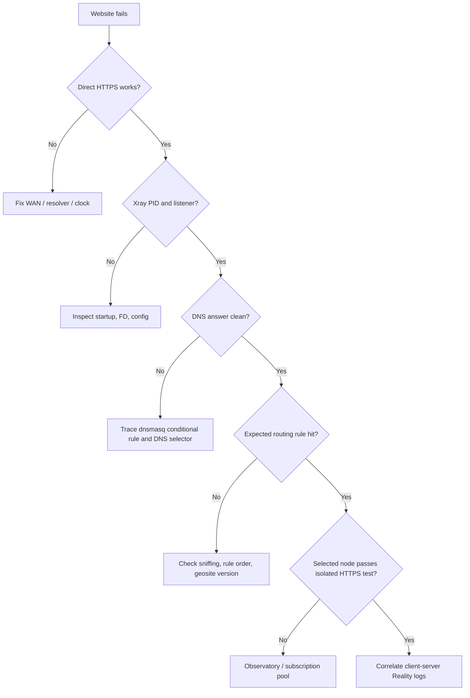

# Verification and recovery runbook

Use this after a deployment, a node/rule update, or a handshake repair. Record pass/fail and sanitized evidence.

## Acceptance matrix

| Area | Test | Required result |
| --- | --- | --- |
| Management | Open router UI/SSH from LAN | reachable |
| WAN | Direct HTTPS with proxy disabled | succeeds |
| Process | PID, expected listeners, FD/RSS | healthy and bounded |
| Direct policy | Known direct site + egress comparison | direct path |
| GFW policy | Known listed site + egress comparison | proxy path |
| Direct DNS | ordinary domain lookup | nearby resolver, plausible answer |
| GFW DNS | listed domain lookup | clean proxy-only path |
| Restart | restart Xray, repeat above | same behavior |
| Failure | block/stop proxy node | documented fail-open/closed behavior |
| Rollback | install deliberately invalid candidate | rejected; current service untouched |
| Reboot | authorized reboot | Wi-Fi, WAN, Xray, firewall, cron restored |

Do not use a sensitive node endpoint or subscription URL as test output.

## Diagnose a failed web test

## Failure simulation safety

Prefer narrow, reversible simulations:

- stop only the test Xray instance;
- temporarily point a candidate outbound at an unused local port;
- install a temporary reject rule for one test endpoint;
- supply an intentionally invalid candidate to the validator without swapping it live.

Avoid disconnecting the only management interface. Set a timed rollback before a firewall experiment when the firmware supports it.

## Recovery order

1. Preserve the current error and hashes without secrets.
2. Remove only this project's transparent interception chain/rule.
3. Confirm direct WAN and LAN management.
4. Restore the previous config or rule data.
5. validate it with the exact Xray binary;
6. restart Xray and reinstall only the project's idempotent rules;
7. repeat DNS, direct, and proxy tests;
8. rotate leaked credentials if logs or terminal output exposed them.

## Handoff checklist

- topology and rule order documented;
- fail-open/closed decision documented separately for data and DNS;
- service and cron entries listed;
- protected files and modes listed, values redacted;
- status/restart/direct/proxy/update/rollback commands documented;
- current and previous config/rule versions identified by hash;
- wired or physical recovery path documented;
- remaining single points of failure identified.
